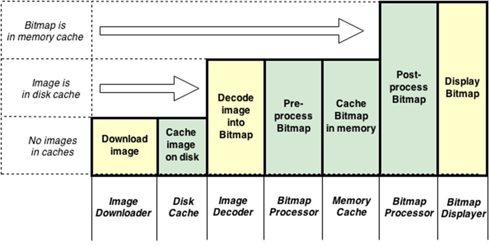

#Universal image loader

##基本原理

由图可以看出，UIL加载图片大概分为如下八个步骤

1. 下载图片

1. 将图片缓存到硬盘，此时为一个png或者jpg图像，需要解码为bmp格式的才能快速的显示

1. 将图片解码成Bitmap

1. 对Bitmap进行预处理

1. 将Bitmap缓存到硬盘

1. 对Bitmap进行后处理

1. 展示到屏幕

如果图片在硬盘缓存里，则不需要前两步，如果图片缓存在内存中，则只需要后两步。

##基本API

加载并解码图片，显示在imageView里：

	imageLoader.displayImage(imageUri, imageView);

加载图片，解码成Bitmap并在回调函数里使用：

	imageLoader.loadImage(imageUri, new SimpleImageLoadingListener() {
	    @Override
	    public void onLoadingComplete(String imageUri, View view, Bitmap loadedImage) {
	        // Do whatever you want with Bitmap
	    }
	});

加载图片，解码为Bitmap并将Bitmap返回，这个方法是同步的（很慢）：

	Bitmap bmp = imageLoader.loadImageSync(imageUri);

加载图片，解码为Bitmap，将Bitmap展示到ImageView

	imageLoader.displayImage(imageUri, imageView, options, new ImageLoadingListener() {
	    @Override
	    public void onLoadingStarted(String imageUri, View view) {
	        ...
	    }
	    @Override
	    public void onLoadingFailed(String imageUri, View view, FailReason failReason) {
	        ...
	    }
	    @Override
	    public void onLoadingComplete(String imageUri, View view, Bitmap loadedImage) {
	        ...
	    }
	    @Override
	    public void onLoadingCancelled(String imageUri, View view) {
	        ...
	    }
	}, new ImageLoadingProgressListener() {
	    @Override
	    public void onProgressUpdate(String imageUri, View view, int current, int total) {
	        ...
	    }
	});

加载图片，解码为Bitmap并将Bitmap传给callback函数

	ImageSize targetSize = new ImageSize(80, 50); // result Bitmap will be fit to this size
	imageLoader.loadImage(imageUri, targetSize, options, new SimpleImageLoadingListener() {
	    @Override
	    public void onLoadingComplete(String imageUri, View view, Bitmap loadedImage) {
	        // Do whatever you want with Bitmap
	    }
	});

加载图片，解码为Bitmap并返回，这个函数是同步调用的：

	ImageSize targetSize = new ImageSize(80, 50); // result Bitmap will be fit to this size
	Bitmap bmp = imageLoader.loadImageSync(imageUri, targetSize, options);

##Configuration

该类用于配置ImageLoader，它对整个应用有效并且只应该被配置一次。配置的示例代码如下：

	File cacheDir = StorageUtils.getCacheDirectory(context);
	ImageLoaderConfiguration config = new ImageLoaderConfiguration.Builder(context)
        .memoryCacheExtraOptions(480, 800)
        .build();

所有的可配置选项有

1. memoryCacheExtraOptions 设置用于解码并保存到内存时图片的最大宽高，默认值是设备屏幕的宽和高。

1. diskCacheExtraOptions 设置参数，在被下载的图片保存到disk缓存之前，进行resize或者压缩。三个参数分别为最大宽度、最大高度、图片处理的函数，前两个的默认值是设备屏幕的宽和高，第三个参数可以为null。

1. taskExecutor 设置自定义的图片加载和展示的执行器

1. taskExecutorForCachedImages 设置自定义的用于展示缓存在disk上面的执行器。

1. threadPoolSize 设置用于图片展示任务的线程池的大小，默认值是DEFAULT_THREAD_POOL_SIZE。

1. threadPriority 设置用来加载图片的线程的优先级。

1. tasksProcessingOrder 设定用来加载和展示图片的队列类型。

1. denyCacheImageMultipleSizesInMemory 对于同一个图片，如果先在小的ImageView中展示，然后再在大的ImageView中展示，默认的行为是内存中会有多份解码完的图片，如果调用该函数，则新的Bitmap生成后。老的将被删除。

1. memoryCache 默认情况下内存缓存会使用LruMemoryCache即app可用内存的八分之一用于缓存Bitmap，也可以手动指定缓存区域，如果手动指定，memoryCacheSize和memoryCacheSizePercentage将失效。

1. memoryCacheSize 设置用于缓存Bitmap的最大内存大小，默认是八分之一，如果使用这个方法，则使用LruMemoryCache进行存储，也可以使用memoryCache来指定自己的缓存实现。

1. memoryCacheSizePercentage 与上一个函数作用相同，不过这个用的是百分比。

1. diskCache 设置图片的disk缓存，默认使用UnlimitedDiskCache，存储的路径为StorageUtils.getCacheDirectory(context)，也可以自己设定缓存实现，但是这将会导致diskCacheSize、diskCacheFileCount、diskCacheFileNameGenerator实效。

1. diskCacheSize 设定用于缓存图片的最大disk大小，默认是无限大的，如果使用这个方法，则会用LruDiskCache来缓存图片，可以使用diskCache指定自定义的实现。

1. diskCacheFileCount 用来指定缓存的最大文件数，默认是无限的。

1. diskCacheFileNameGenerator 用来设置disk缓存上文件名字的生成器，默认是createFileNameGenerator。

1. imageDownloader 设置图片下载器，默认是DefaultConfigurationFactory.createImageDownloader()。

1. imageDecoder 设置图片解码器。

1. defaultDisplayImageOptions 设定展示图片到ImageView的DisplayImageOptions，它将会对每一张图片的展示生效，如果不另外输入参数的话。

1. writeDebugLogs

##Display Options

对每一个展示任务都可以设定该参数，如果没有设定则使用默认值。

所有可配置的选项有

1. showImageOnLoading 设置图片加载期间展示的图片

1. showImageForEmptyUri 设置uri为null或者""时展示的图片

1. showImageOnFail 设置图片加载或者解码过程中出错时展示的图片。

1. resetViewBeforeLoading 设置图片下载前是否重置view。注：需要仔细研究下

1. delayBeforeLoading 设置下载开始前的延时，默认无延时。

1. cacheInMemory 设置下载的图片是否缓存到内存里。

1. cacheOnDisk 设置下载的图片是否缓存到disk里。
        
1. preProcessor 设置预处理器，在解码生成的bitmap被缓存到内存之前生效。

1. postProcessor 设置后处理器，在bitmap被缓存到内存，将要被展示到view的时候生效。

1. extraForDownloader 设置将要传给下载器的辅助object

1. considerExifParams 设置下载器是否要考虑jpeg格式文件的EXIF头。

1. imageScaleType 设置解码图片的ImageScaleType。
 
1. bitmapConfig 设置解码器的参数，默认是ARGB_8888。

1. decodingOptions 设置解码器的参数，一般而言，解码器可以根据imageScaleType计算出最优的参数，如果该项被设置，则bitmapConfig不生效。

1. displayer 对图片加载任务自定义displayer。

1. handler 对图片的展示和事件发射自定义handler。

##注意事项

1. 默认不进行缓存，需要手动设置

	cacheInMemory(true)
 	cacheOnDisk(true)

2. 如果设置了disk缓存，默认会缓存到sd卡，如果sd卡不可用，就会缓存到设备的文件系统。

3. UIL为了确定bitmap的大小，会依次搜索ImageView的真实大小、android:layout_width/layout_height、android:maxWidth/maxHeight、memoryCacheExtraOptions设定的maximum width/height、设备的宽/高。因此，如果设定ImageView的大小有助于节约内存。

4. 如果经常内存溢出，可以考虑禁用内存缓存。

5. 系统自带几种不同的内存、硬盘缓存实现。

6. 系统自带几种不同的displayer实现。

7. 为了避免list或者grid在滑动时的卡顿，可以使用PauseOnScrollListener。

    boolean pauseOnScroll = false; // or true
    boolean pauseOnFling = true; // or false
    PauseOnScrollListener listener = new PauseOnScrollListener(imageLoader, pauseOnScroll, pauseOnFling);
    listView.setOnScrollListener(listener);

8。 ImageLoader不改变图片的长宽比。
