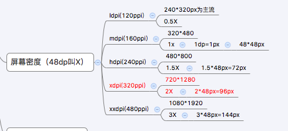
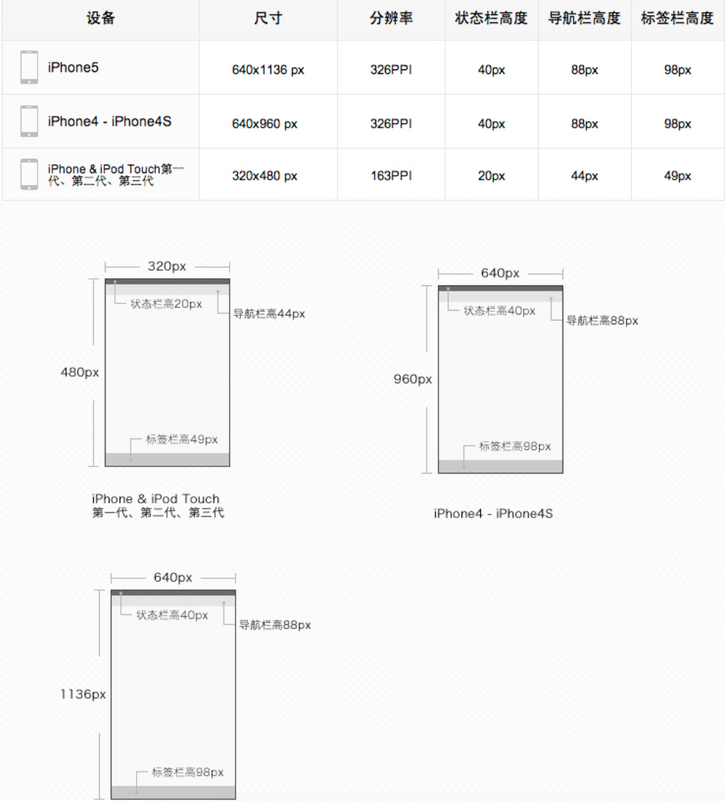
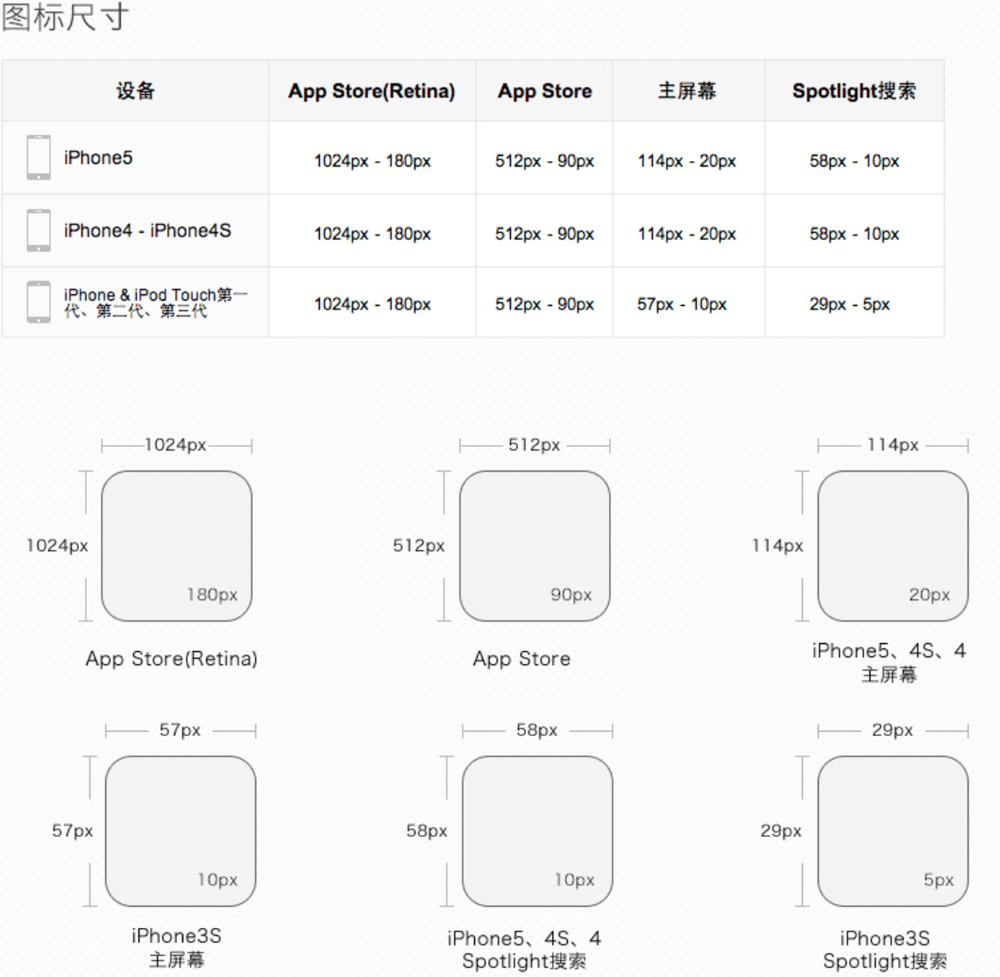
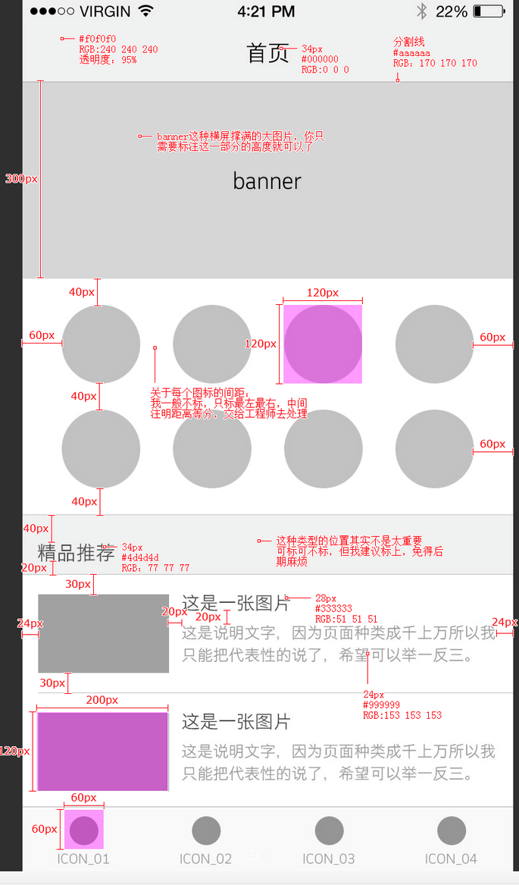
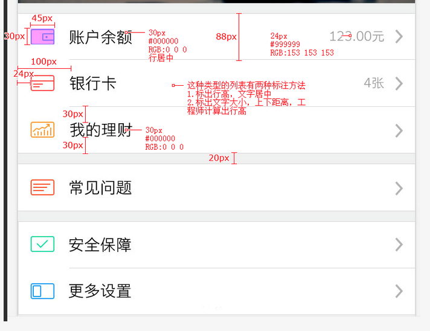

# 关于用户体验的一切

## 序言
本文写于2015年4月21日，公司初步完成了项目的实施，功能基本完备但是用户体验依然有所欠缺，个别产品甚至到了惨不忍睹的地步。一直难以招聘到资深的设计师，我决定尝试自己解决这一问题。我开始问自己，我们希望从我们期待的“资深设计师”身上学到什么，我们拥有了哪些资料之后可以把产品设计完成的更好。我的答案是我们缺少一份文档，然后我就开始着手编写这一份文档，整理用户体验相关的各种元素，以供所有项目相关的成员查看。

## 面临的挑战

## 显示器尺寸与分辨率

### 显示器尺寸
显示器尺寸是指显示器对角线的长度以及长宽比。

//TODO 提供不同尺寸的屏幕所占比例的数据

常见的屏幕分辨率有

1. 常见的笔记本尺寸有：10英寸、11英寸、13英寸、14英寸、15英寸、17英寸(1英寸=2.54cm)
1. 常见的PC尺寸有：21英寸、22英寸、23英寸、24英寸、27英寸、28英寸、30英寸、32英寸
1. 常见的pad尺寸有：7英寸、10英寸
1. 常见的智能手机尺寸有：3.5英寸、4英寸、4.3英寸、5英寸、5.5英寸

//TODO 提供不同长宽比的屏幕所占比例的数据

常见的屏幕长宽比有

1. 4:3 早期的CRT显示器常用的比例
1. 16:9 常规的液晶显示器均采用这个比例，大多数手机及iPhone 5/iPhone 5s均适用这一比例
1. 16:10 Macbook及iPhone 5之前的iPhone均采用此比例

### 分辨率

屏幕都是有很多像素点组成，所谓的分辨率是指横向的像素数乘以纵向的像素数。

### PPI与视网膜显示器

Pixels Per Inch所表示的是每英寸所拥有的像素(Pixel)数目

### PC分辨率

//TODO 提供不同分辨率的屏幕所占比例的数据

主流的PC分辨率有

1. 1024×768 
1. 1280×800 
1. 1280×1024 
1. 1440×900 
1. 1920×1050 

### Mac分辨率

几种常见的Macbook的分辨率

|   model     |    分辨率      |
| ----------- | ------------- |
|   test      |    test2      |

### 安卓设备分辨率

### iOS设备分辨率

### Apple Watch分辨率

## 设备颜色

### 色彩空间

### 色温

### Gamma值

## 设备独立像素

### 安卓

### iOS

### Mac Retina

## 字体与字体渲染

### 常用字体

### Windows字体渲染机制

### Linux字体渲染机制

### Mac字体渲染机制

## 安卓设计规范
###1.尺寸规范
####1.1  界面设计尺寸
#####720*1280px
在5种输出的分辨率（MDPI. HDPI.XHDPI.XXHDPI）中按中间值（XHDPI）设计

Android  dp与 px换算：

 
####1.2 界面元素尺寸
状态栏：**50px**,导航栏：**96px**,标签栏：**120px**,图标大小**96*96px**。
在app的设计中，状态栏＋导航栏高度128px,标签栏120px。

|   屏幕大小     |    启动图标      |   操作栏图标   |    上下文图标  |系统通知图标 |
| -----------   | -------------   | -----------   | ------------- | --------- |
|   320*480px   |    48*48px      |  32*32px      |    16*16px    |  24*24px  |
|   480*800px   |    72*72px      |  48*48px      |    24*24px    |  36*36px  |
|   720*1280px  |   48*48dp       |  32*32dp      |    16*16dp    |  24*24dp  |
|   1080*1920px |   144*144px     |   96*96px     |    48*48px    |  72*72px  |

####1.3 字体字号
安卓系统默认的英文字体 **Roboto**,安卓手机的默认中文字体都是**droid sans fallback**,是谷歌自己的字体，
与微软雅黑，方正兰亭黑很像，在app设计中采用的是**方正兰亭**系列字体。

- 标准字 **36px**  用在少数重要标题 
如：导航标题 分类名称
- 标准字 **30px** 用在一些较为重要的文字或操作按钮
如：首页模块名称
- 标准字 **28px** 用于大多数文字
特别适用于大段文字
- 标准字 **26px** 用于大多数文字
如：小标题  模块描述
- 标准字 **24px** 用于辅助性文字
如：次要的副标语等
- 标准字 **22px** 用于辅助性文字
如：次要的备注信息等

###2.批量切图
所有设计尺寸，包括图形效果，应该尽量使用**偶数**。

###3.安卓设计中运用到设计颜色
- 
＃9999999
用于辅助次要的文字信息、普通按钮描边
- 
＃666666
用于普通级段落信息、引导词
- 
＃cccccc
用于分割线、标签描边
- 
＃191919
用于导航标题、分类名称

### Material Design综述

## iOS设计规范
###1.尺寸规范
####1.1界面设计尺寸
#####640*1136px
iPhone界面尺寸：320 × 480  640×960   640×1136

iPhone6:4.7英寸（1334 × 750），iPhone6 Plus:5.5英寸（1920×1080）
####1.2界面元素尺寸
iPhone的app界面一般由四个元素组成
分别是：状态栏、导航栏、主菜单栏、内容区域

- 状态栏：高度为**40px**
- 导航栏：高度为**88px**
- 主菜单栏：高度为**98px**
- 内容区域：高度为**910px**

**iphone界面尺寸**

####1.3字体字号
iPhone上的英文字体为：**helveticaNeue**。至于中文字体，Mac用的是 **黑体** 和 **苹果丽黑**,
其他用 **华文黑体** （最新字体称为**黑体－简**）。

- 标准字 **36px**  用在少数重要标题 
如：导航标题 分类名称
- 标准字 **30px** 用在一些较为重要的文字或操作按钮
如：首页模块名称
- 标准字 **28px** 用于大多数文字
特别适用于大段文字
- 标准字 **26px** 用于大多数文字
如：小标题  模块描述
- 标准字 **24px** 用于辅助性文字
如：次要的副标语等
- 标准字 **22px** 用于辅助性文字
如：次要的备注信息等

###2.批量切图
所有设计尺寸，包括图形效果，应该尽量使用**偶数**。

###3.标注
- 文字需要提供：字体大小（px）,字体颜色。
- 需要提供：顶部标题栏的背景色值。
- 需要提供：内容显示区域的背景色。
- 需要提供：底部的背景色值。

###4.iOS设计中运用到设计颜色
- 
＃9999999
用于辅助次要的文字信息、普通按钮描边
- 
＃666666
用于普通级段落信息、引导词
- 
＃cccccc
用于分割线、标签描边
- 
＃191919
用于导航标题、分类名称

##综述

## Web设计规范
###1.pc端网页的设计尺寸
目前用的设计尺寸:**1366*768**
###2．标准字
在pc端：设计稿中字体为系统默认字体，Mac电脑统一是**苹果丽黑**会更好。
在pc端统一的标准字大小是**12px**。
###3.切图
你的所有设计尺寸，包括图形效果，应该尽量使用**偶数**。
如有需要图片切两套，pc端和移动端。平常pc端就可以。
###4.页面标注
- 文字需要提供：字体大小（px）,字体颜色。
- 需要提供：顶部标题栏的背景色值。
- 需要提供：内容显示区域的背景色。
- 需要提供：控件的大小、间距。

###5.响应式设计
- 响应式设计需要提供给设计师两套原型，PC版本和移动版本各一套，同时提供最终设计效果的参考图。
- 响应式标注 横向按照百分比、像素两种方式标注，纵向按照像素或者图片比例标注，必要时使用hype3制作响应
或交互效果的展示。

## Mac设计规范

## PC设计规范

## 版式设计

## 交互设计规范

## 配色方案

## 动效设计方案

## 流程规范

## 心智模型

## 资源

